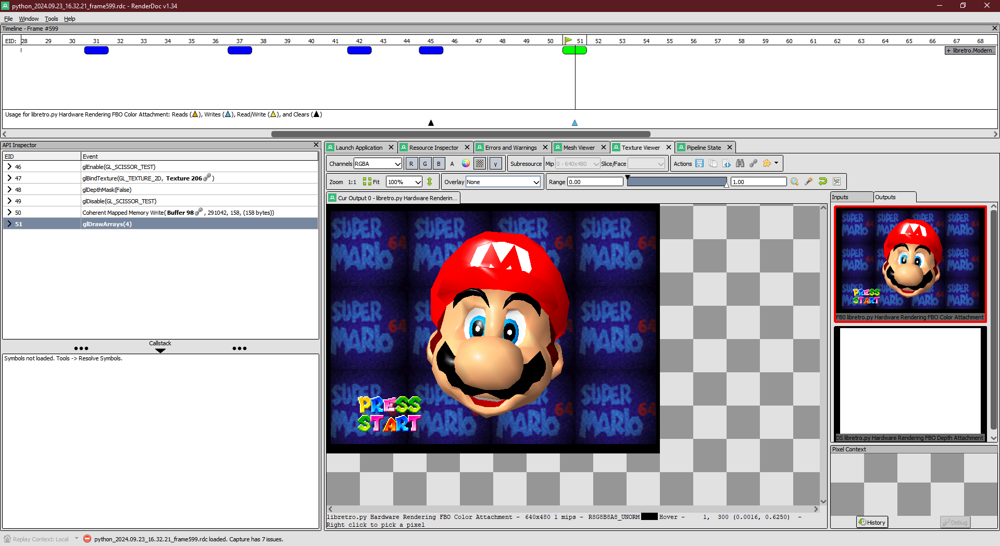

Capturing a Graphics Frame with RenderDoc
=========================================

RenderDoc_ is a frame debugger that provides detailed information about
the API calls and pipeline state that produced a frame.
It supports all major graphics APIs,
and can be used in any application that creates a window.
This guide walks you through using RenderDoc to capture a frame from a libretro core
running in libretro.py.

.. important::

    This is *not* a tutorial for using RenderDoc;
    this guide assumes that you're proficient enough
    to analyze a capture after you've taken it.
    See the `official docs <https://renderdoc.org/docs>`_ for more guidance.

In this guide we'll use `Mupen64Plus-Next <https://docs.libretro.com/library/mupen64plus>`_ to demonstrate,
though any core will work.

Getting Started
---------------

We'll use the provided ``libretro.py.test.runs`` script to run the core.
Make sure that you've installed the ``cli`` extra when you installed libretro.py.
This script is a simple way to run a core for fixed length of time.

.. admonition:: Prefer to use a custom script?

    You can use RenderDoc to capture a frame
    even if you're using a custom test script.
    However, the process of configuring
    your core's content, system files, and options
    may be different.

Once you install RenderDoc,
open up the `Launch Application tab <https://renderdoc.org/docs/window/capture_attach.html>`_
and configure it like so:

:guilabel:`Executable Path`
    Select the Python executable you're using to run libretro.py.
    If you're using a virtual environment,
    see `Using a Virtual Environment`_ for more information.

:guilabel:`Working Directory`
    You can leave this as-is
    unless your core or custom test script
    expects a specific working directory.

:guilabel:`Command-line Arguments`
    Enter the following: :samp:`-m libretro.py.test.runs {path-to-core} {path-to-content} -Omupen64plus-rdp-plugin=gliden64 -n600 --window`

    Let's break this down:

    :samp:`-m libretro.py.test.runs`
        Using Python's ``-m`` flag will run the given module as a script,
        in this case the ``libretro.py.test.runs`` module
        included with libretro.py.

    :samp:`{path-to-core}`
        Replace this with the path to the core you're using.
        For the purpose of this guide, we're using Mupen64Plus-Next;
        on my machine, that's :file:`D:/SteamLibrary/steamapps/common/RetroArch/cores/mupen64plus_next_libretro.dll`.

        .. important::

            This needs to be a full path, *not* a short name like RetroArch uses
            (i.e. passing an argument of :file:`mupen64plus_next` will not work
            unless that's literally the name of a core in the current working directory).

    :samp:`{path-to-content}`
        Replace this with the path to the content you're running.
        For this guide, I'm using a ROM located at :file:`D:/ROMs/N64/Super Mario 64 (U) [!].z64`.

        .. tip::

            If you're using a core that supports running without content,
            you can leave this out.
            If you're using a subsystem,
            you'll need to include the subsystem name
            with the ``-s`` flag,
            plus additional content files after the main one if necessary.

    :samp:`-Omupen64plus-rdp-plugin=gliden64`
        The ``-O`` flag defines an option that will be passed to the core.
        It can be given as many times as you like,
        with each value given as :samp:`-O{name}={value}`.
        In this case we're telling Mupen64Plus-Next to use the GlideN64 renderer;
        we want to use this particular renderer because it uses OpenGL,
        which is the only graphics API that libretro.py supports at the moment.

    :samp:`-n600`
        The ``-n`` flag tells ``libretro.py`` to run the core for a fixed number of frames.
        In this case, we're running for 600 frames (about 10 seconds).

    :samp:`--window`
        This flag tells ``libretro.py`` to create a window for the core to render to.
        This is necessary for RenderDoc to capture the frame.

    Run ``python -m libretro.py.test.runs --help`` for more details about available flags.

**Environment Variables**
    You can leave this blank
    unless your core or custom script
    expects specific environment variables.

    If you're using a virtual environment,
    see `Using a Virtual Environment`_ for more information.

Taking a Capture
----------------

Now that we've got our capture settings for RenderDoc in place,
we can run the core and take a capture.
You'll want to save your capture settings to avoid having to retype them later,
but make sure not to commit them to your Git repo.

You can either take a capture with the :kbd:`F12` key
or queue up one or more captures to be taken automatically.

.. hint:: Why not use RetroArch for capturing frames instead?

    You absolutely can!
    However, frontends intended for gameplay tend to allocate their own graphics resources
    for features like UI overlays or shader effects.
    You may find these to be a distraction when trying to debug your core.
    libretro.py only allocates the resources needed to support GPU-rendered cores.

Using a Virtual Environment
---------------------------

Using libretro.py through a virtual environment to capture frames is supported,
but may require a few extra steps depending on your platform.
The following recommendations come from my own experience
using RenderDoc and libretro.py on Windows.

First, you may need to set the :guilabel:`Executable Path` to the Python executable
from which your virtual environment is derived,
**not** the executable in the virtual environment itself.
On Windows, this is actually a thin launcher for the system Python installation
with some environment variables set to point to the virtual environment.

Second, you may need to adjust the :guilabel:`Environment Variables`
to set :samp:`PYTHONPATH` to include the path to the virtual environment's site-packages directory.
If you're using a local copy of libretro.py (e.g. when contributing or fixing a bug),
you may also need to include the path to the directory containing libretro.py itself.

.. _RenderDoc: https://renderdoc.org

